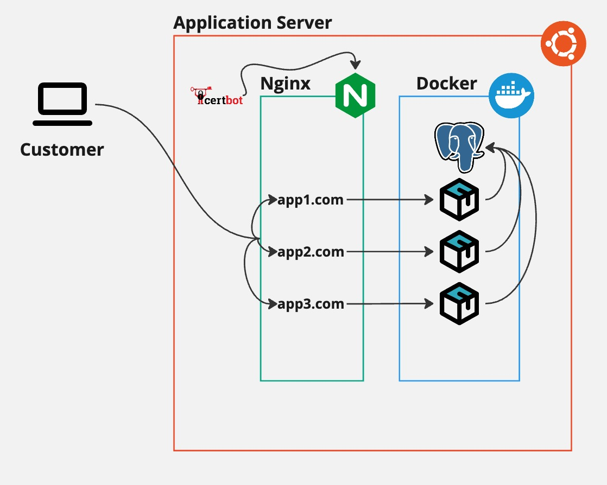

# Before you start


You need to first install Ansible on your local machine in order to execute ansible playbooks. Please use the following link to install Ansible: https://docs.ansible.com/ansible/latest/installation_guide/intro_installation.html#installation-guide

# Current architecture
<div style="text-align: center;">
  
</div>

We have a single server setup. This server uses Nginx and Docker. Each application runs as a container within Docker. Additionally, all application dependencies, such as PostgreSQL, Elasticsearch, and Redis, are also run as containers inside Docker.

# How to setup the application server?
... To be written

## Remove Backport Repositories
Backport repository is not needed for our installation. For this reason,
we are going to remove these repositories from apt sources.
```
ansible-playbook playbook/remove_repositories.yaml -i inventory.yml
```

## Install Docker
In order to run our applications, we need to have a docker installed in out system.
```
ansible-playbook playbook/install_docker.yaml -i inventory.yml
```

## Install Nginx and configure SSL certificates with Certbot
In order to serve our applications to visitors, we are using nginx as a web server.
```
ansible-playbook playbook/100-nginx.yaml -i inventory.yml
```

## Create an app user and add to Docker group
Our docker containers do not run as a root, they run under the user `app`. This
user is added to the `docker` group.
```
ansible-playbook playbook/create_user.yaml -i inventory.yml
```

## How can I add a new domain?
- Open `playbook/nginx.yaml` file in your editor.
- Find the variables in the find, it should look like this:
```
  vars:
    nginx_sites:
      - server_name: pazl.dev
        admin_email: dev@pazl.dev
        apps:
          - location: /password
            proxy: http://127.0.0.1:8000
```
- Then modify it according to your needs.
- After your modifications, you can run the following command in order to apply them.
```
ansible-playbook playbook/nginx.yaml -i inventory.yml
```

## How can I install MySQL service in Docker?
- Open `playbook/mysql_docker_playbook.yaml` file in your editor.
- Adjust the mysql version according to your needs.
```
ansible-playbook playbook/mysql_docker_playbook.yaml -i inventory.yml
```
